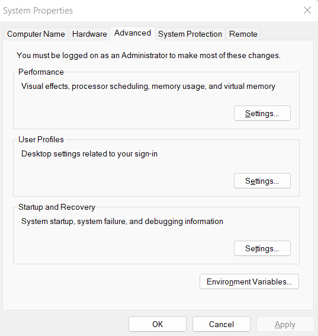
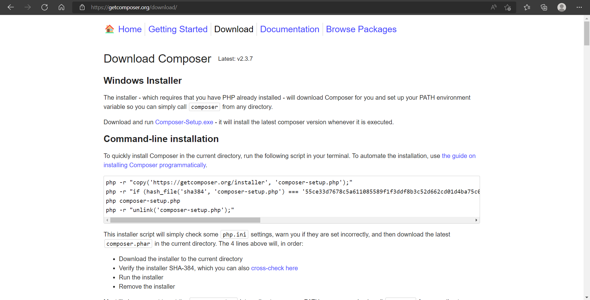
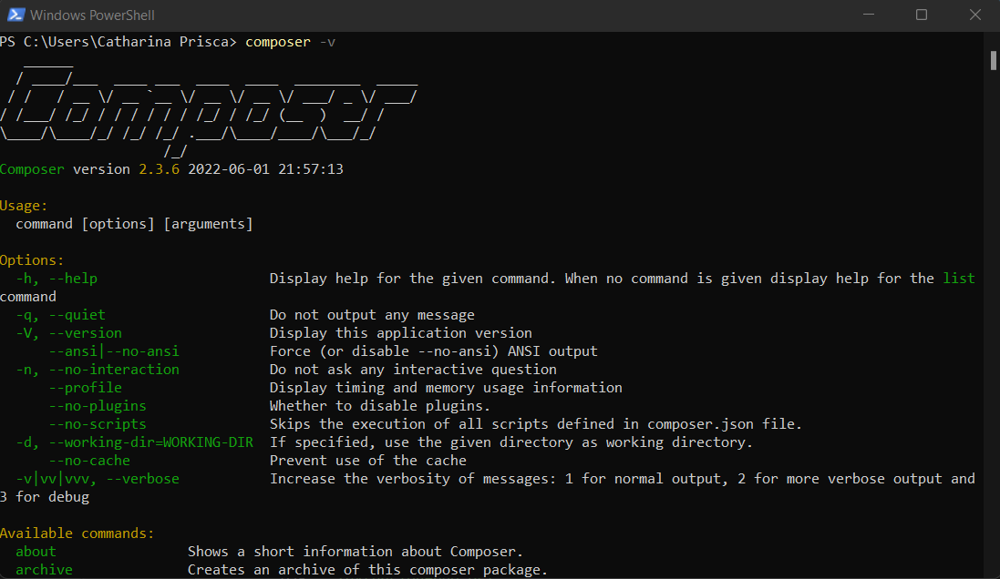
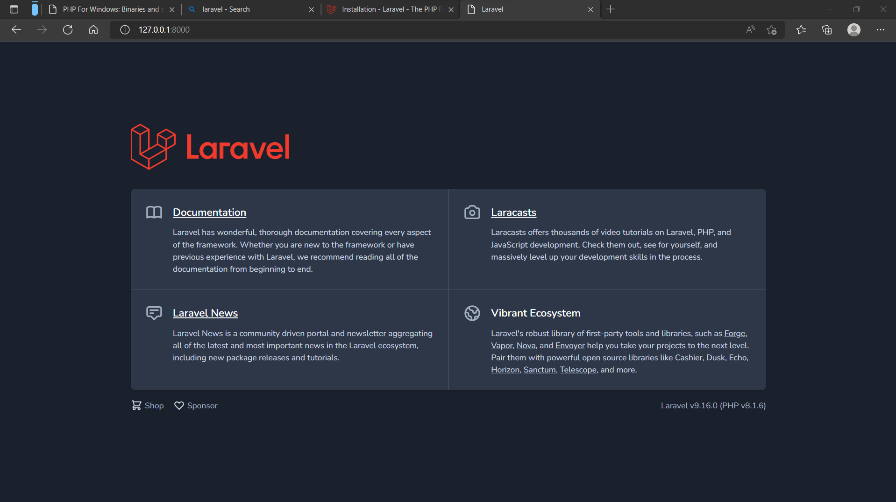

# Final Project

## Catharina Prisca Titi Larasati | 1202192049 | IT0202

### First Step

* Buka website https://windows.php.net/download#php-8.1 untuk mendownload php, dan pilih file zip Thread Safe.

  


* Extract file php, lalu copy dan paste di lokasi "C:\Program Files". Kemudian cari file bernama "php.ini development", lalu buat salinan dan rename file salinan tersebut menjadi "php.ini". Buka text editor, lalu ubah setting menjadi seperti gambar dibawah ini, dan simpan.

  

  


* Tekan Windows dan klik Environment, kemudian buka The Edit System Environment Variables, dan pilih Environment Variables

  

  

* Pilih variable path untuk menambahkan alamat dari file php, kemudian pilih ok.

  


* Buka terminal dan ketikkan php -v. Jika tampilan yang muncul seperti pada gambar dibawah ini, maka tandanya php telah berhasil terinstall.

  


### INSTALL COMPOSER

* Buka website https://getcomposer.org/download/ untuk mendownload composer

  


* Install file composer yang sudah di download. Selanjutnya buka terminal dan ketik "composser", maka akan muncul tampilan seperti pada gambar dibawah ini. Ini menandakan bahwa composer sudah berhasil di install.

  


### INSTALL LARAVEL VIA COMPOSER

* Buka website https https://laravel.com/docs/9.x#installation-via-composser untuk menyalin command instalasi laravel via composer.

* Buat folder seperti biasa lalu buka terminal dan masuk ke dalam folder yang telah dibuat, lalu install laravelnya. 

* Buat project untuk install laravel dengan command 


  ```markdown
  composer create-project laravel/laravel nama_project
  ```

  

  


* Copy server laravel, untuk dibuka di browser

  
